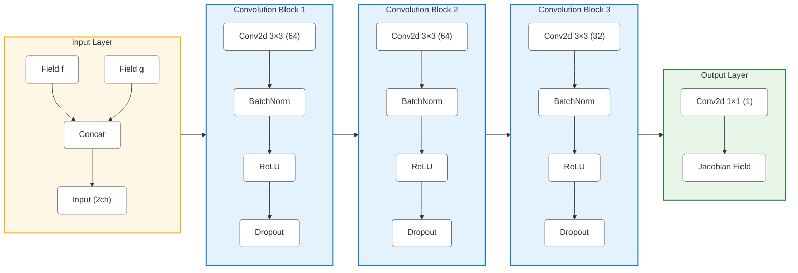

# Neural Network for Arakawa Jacobian Computation

A PyTorch-based implementation for learning and computing Arakawa Jacobians using neural networks. This project includes data generation, model training, and inference capabilities with a focus on conservation properties.

## Features

- Generate diverse fluid dynamics training data
- Implementation of Arakawa's nine-point stencil finite difference method
- Memory-efficient dataset handling with HDF5
- Custom conservation-aware loss function
- Configurable neural network architecture
- Comprehensive training pipeline with:
  - Early stopping
  - Learning rate scheduling
  - Model checkpointing
  - Training visualization
  - Memory optimization

## Technical Details

The Arakawa Jacobian scheme uses a nine-point stencil for spatial discretization, which helps preserve important physical invariants such as energy and enstrophy. This numerical scheme is particularly effective for geophysical fluid dynamics simulations where conservation properties are crucial.

#
Model Architecture

The neural network (`JacobianNet`) is designed to learn and compute Arakawa Jacobians efficiently. Here's the detailed architecture:


### Architecture Details:

1. **Input Layer**
   - Takes two 2D fields (f and g) as input
   - Concatenates them into a 2-channel input

2. **Convolutional Blocks**
   - Three main convolutional blocks
   - Each block contains:
     - 2D Convolution (3x3 kernel)
     - Batch Normalization
     - ReLU activation
     - Dropout (20%)

3. **Output Layer**
   - 1x1 convolution to produce final Jacobian field
   - Maintains spatial dimensions of input

4. **Features**
   - Preserves spatial relationships
   - Handles multiple scales through hierarchical processing
   - Regularization through dropout and batch normalization
   - Parameter efficient design

## Usage

### 1. Generate Training Data

```bash
python compute_jacobian.py
```

This script will:
- Generate diverse field pairs (turbulent, vortex, shear, mixed)
- Compute corresponding Arakawa Jacobians using the nine-point stencil method
- Save the dataset in HDF5 format

### 2. Train the Model

```bash
python model.py --data_path path/to/your/data.h5 \
                --save_dir model_checkpoints \
                --subset_size 49000 \
                --batch_size 32 \
                --num_epochs 50 \
                --learning_rate 0.001
```

Training features:
- Automatic train/validation split
- Progress monitoring
- Checkpoint saving
- Loss visualization
- Early stopping
- Learning rate scheduling

### 3. Inference

```python
from model import load_model_for_inference

# Load the model
model, stats = load_model_for_inference('path/to/model_checkpoints/inference_model.pt')

# Make predictions
with torch.no_grad():
    prediction = model(f_input, g_input)
```

## Training Details

The training process includes:
- Data normalization
- Memory-efficient batch processing
- Conservation-based loss function incorporating:
  - Mean squared error
  - Mean vorticity conservation
  - Energy conservation
  - Square vorticity conservation
- Early stopping based on validation loss
- Learning rate reduction on plateau

## License

This project is licensed under the MIT License - see the [LICENSE](LICENSE) file for details.

## Contributing

Contributions are welcome! Please feel free to submit a Pull Request.


